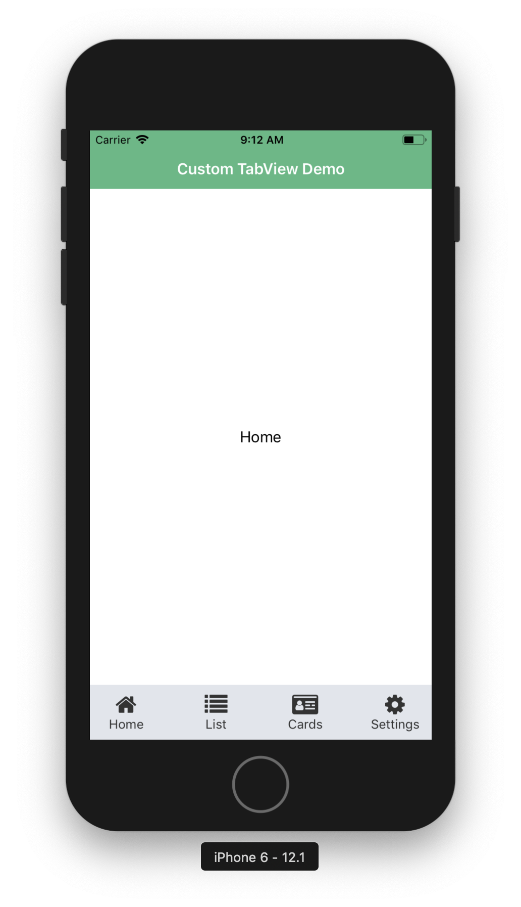

# NativeScript Vue custom TabView Demo with Icons

Nativescript Vue demo implementation of custom TabView with icons.

> This repository make use of nativescript-vue's `FlexboxLayout` and `GridLayout` to design basic TabView with font awesome icons.

<p align="center">

</p>

## Install
``` bash
git clone https://github.com/saikksub/nativescript-vue-demo-tabview-custom.git
cd nativescript-vue-demo-tabview-custom
cd demo
npm install
```

## Demo
``` bash
tns run <platform> --bundle
```

## License
[MIT](https://opensource.org/licenses/MIT)

## Author
[saikksub](https://github.com/saikksub)
